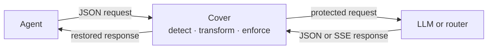

<h1 align="center">Cover</h1>

<p align="center"><strong>Keep sensitive values out of LLM requests without breaking the conversation.</strong></p>

<p align="center">
  <a href="https://github.com/DavidCarliez/cover/actions/workflows/ci.yml"></a>
  <a href="go.mod"></a>
  <a href="LICENSE"></a>
</p>

<p align="center">
  <a href="#install">Install</a> ·
  <a href="#quick-start">Quick start</a> ·
  <a href="#privacy-policies">Policies</a> ·
  <a href="#inspect-diagnose-and-monitor">Monitoring</a> ·
  <a href="#security-boundary">Security</a>
</p>

Cover is a local privacy proxy for Codex, Claude Code, Cursor, SDKs, and other
HTTP-based AI clients. It scans outgoing JSON, replaces matched values locally,
and restores reversible replacements in JSON and streaming responses. The LLM
receives the protected values, while the agent can continue using the originals.

Cover runs as a transparent reverse proxy with policy-driven replacement,
deterministic pseudonyms, operational checks, Codex support, and strict failure
handling. It is designed to stay local, observable, and explicit about what it
cannot inspect.



## Highlights

| Area | Cover functionality |
| --- | --- |
| Policy | Declarative rules with `allow`, `placeholder`, `pseudonymize`, `mask`, `redact`, and `block` actions |
| Realistic replacements | Deterministic generators for IP addresses, hosts, domains, emails, usernames, passwords, UUIDs, URLs, and aliases |
| Context-aware rules | Whole-value protection by JSON key, including short passwords such as `admin`, plus regex and built-in detector selectors |
| Stable identities | Installation-keyed HMAC pseudonyms remain consistent across requests, sessions, and restarts |
| Mapping safety | Bounded, session-isolated, memory-only reversible mappings with TTL and capacity limits |
| Inspection | `cover inspect` previews the protected JSON without contacting an LLM |
| Diagnostics | `cover doctor` verifies policy, daemon health, local fail-closed behavior, and Codex routing |
| Monitoring | Metadata-only audit and monitor views, plus explicit live-only inspection of caught and forwarded content |
| Proxy hardening | Loopback-by-default listeners, body and stream limits, generic safe errors, and fail-closed parsing |
| Codex compatibility | Responses API and router configuration, compression checks, safe SSE restoration, and immutable `encrypted_content` fields |
| Optional semantic pass | A local llama.cpp detector can inspect free-form text that regular expressions miss |

## Install

The installer clones Cover, builds it with Go, installs it to
`~/.local/bin/cover`, configures selected clients, and starts the proxy.

```sh
curl -fsSL https://raw.githubusercontent.com/DavidCarliez/cover/main/scripts/install.sh | bash
```

Requirements: `git` and the Go version declared in [`go.mod`](go.mod).

For a non-interactive install:

```sh
COVER_AGENTS=openai,claude \
  curl -fsSL https://raw.githubusercontent.com/DavidCarliez/cover/main/scripts/install.sh | bash
```

<details>
<summary><strong>Build manually or cross-compile</strong></summary>

```sh
git clone https://github.com/DavidCarliez/cover.git
cd cover
go build -o cover ./cmd/cover
install -m 0755 cover ~/.local/bin/cover
```

The core binary has no cgo dependency. Standard Go cross-compilation works:

```sh
GOOS=linux GOARCH=arm64 go build -o cover-linux-arm64 ./cmd/cover
GOOS=windows GOARCH=amd64 go build -o cover.exe ./cmd/cover
```

</details>

## Quick start

```sh
cover init             # write ~/.config/cover/config.yaml
cover start --detach   # run in the background
cover doctor           # verify the local setup
cover test             # local redaction round trip, no network call
cover monitor          # watch privacy-safe request metadata
```

`cover init` prompts for OpenAI, Anthropic, or a custom upstream. The complete
configuration is documented in [`configs/config.example.yaml`](configs/config.example.yaml).

### Command reference

| Command | Purpose |
| --- | --- |
| `cover install` | Configure clients, shell exports, and the background proxy |
| `cover init` | Create the configuration file |
| `cover start [--detach]` | Start Cover in the foreground or background |
| `cover stop` | Stop the background process |
| `cover restart` | Restart it in the background |
| `cover status` | Show process, listener, and redacted upstream status |
| `cover env` | Print shell exports for configured clients |
| `cover test` | Run a synthetic local redaction and restoration check |
| `cover inspect request.json` | Preview exactly what Cover would forward |
| `cover doctor [--json]` | Run configuration, privacy, daemon, and routing checks |
| `cover monitor` | Show recent safe metadata and follow new events |
| `cover monitor --show-content` | Show sensitive live transformations and outbound JSON |
| `cover models pull` | Download the optional local detector runtime and model |
| `cover models status` | Report local detector installation and configuration |
| `cover completion` | Generate shell completion scripts |

Stopping Cover does not change client configuration. A client still pointed at
Cover will fail to connect until Cover is restarted or the client is pointed
back to its direct provider or router.

## Privacy policies

Built-in regex detection covers AWS and GCP keys, GitHub, GitLab, Slack,
Stripe, and Anthropic tokens, private-key blocks, JWTs, explicit generic secret
assignments, emails, SSNs, credit cards, phone numbers, and IBANs. A bare OpenAI
`sk-...` value is deliberately not a dedicated built-in category. Define an
explicit rule if your environment needs one.

Rules live under `rules` in `~/.config/cover/config.yaml`. A selector can be a
regular expression, a `builtin_*` detector, or a list of JSON object keys.

```yaml
rules:
  password_fields:
    keys: [password, passwd, pwd, passphrase, user_password, database_password]
    category: password
    action: pseudonymize
    generator: password
    priority: 220

  ipv4_addresses:
    detector: builtin_ipv4
    category: ip_address
    action: pseudonymize
    generator: ipv4
    priority: 100

  customer_name:
    pattern: '(?i)\bNIKE\b'
    category: customer
    action: pseudonymize
    generator: alias
    priority: 80

  forbidden_secret:
    pattern: '(?i)secret\s*[:=]\s*(?P<value>[^\s,;]+)'
    action: block
    priority: 200
```

Key selectors protect complete string values. For example,
`{"password":"admin"}` is protected without treating an unrelated
`{"username":"admin"}` as a password. Named `(?P<value>...)` groups let a
regex replace only the captured value.

| Action | Result |
| --- | --- |
| `allow` | Record the match but leave it unchanged |
| `placeholder` | Replace it with a short reversible token |
| `pseudonymize` | Replace it with a realistic, deterministic value |
| `mask` | Keep the first and last characters and mask the middle |
| `redact` | Replace it with `[REDACTED]` |
| `block` | Reject the complete request locally |

Pseudonym generators: `ipv4`, `ipv6`, `hostname`, `domain`, `fqdn`, `email`,
`username`, `password`, `secret`, `uuid`, `url`, and `alias`.

Rules are validated at startup. Invalid selectors, expressions, actions,
generators, or capture groups prevent Cover from starting. Detector errors,
mapping exhaustion, malformed JSON, compressed bodies, and explicit blocks do
not fall back to forwarding the original request.

### Stable pseudonyms and reversible mappings

Cover creates `~/.config/cover/pseudonym.key` with owner-only permissions.
HMAC-SHA-256 derives the same pseudonym for the same original value across
sessions and restarts. Different installations produce different pseudonyms.

The key cannot recover original values. Restoration uses bounded mappings held
only in process memory. Mappings are separated by `X-Cover-Session`, expire
after the configured TTL, and are deleted when an isolated request completes.
Back up the key only if stable pseudonym continuity matters.

## Inspect, diagnose, and monitor

### Preview without sending

```sh
cover inspect request.json
cover inspect request.json --session demo
```

The report contains the transformed request, matched rules, categories,
actions, warnings, and blocked state. It does not send a network request or
print the reversible mapping.

### Check the installation

```sh
cover doctor
cover doctor --json
```

Doctor validates the configuration, listener policy, limits, pseudonym key,
redaction round trip, upstream-loop protection, daemon, fail-closed behavior,
audit log, environment routing, Codex provider, and Codex request compression.
Its live probe is rejected locally and does not spend model tokens.

### Safe monitoring by default

```sh
cover monitor
cover monitor --follow=false -n 50
cover monitor --json
```

The default monitor shows only allowlisted metadata: time, HTTP status,
transformation count, byte counts, latency, categories, and generic errors.
Audit logs never contain request or response bodies, matched values, mappings,
paths, queries, or upstream credentials.

### Explicit sensitive live view

```sh
cover monitor --show-content
cover monitor --show-content --once
cover monitor --show-content --json
```

This opt-in view shows each caught original and replacement, followed by the
exact transformed JSON handed to the upstream transport. It is live-only and
never added to the audit log. Capture starts after an authenticated local
viewer connects and stops when it disconnects. The stream is loopback-only,
uses a token derived from the installation key, and disconnects slow viewers.

> [!WARNING]
> This terminal output is sensitive. Do not use `--show-content` in shared
> terminals, recorded sessions, CI logs, or support transcripts.

## Connect clients

Cover forwards request methods, paths, queries, and headers to the configured
upstream. Existing provider authentication still works because Cover does not
rewrite authentication headers.

### Codex and Codex Router

Codex uses the Responses API. Add a user-level provider to
`~/.codex/config.toml` and disable request compression so Cover can inspect the
body:

```toml
model_provider = "cover"

[model_providers.cover]
name = "Cover"
base_url = "http://127.0.0.1:8317"
wire_api = "responses"
requires_openai_auth = true
supports_websockets = false

[features]
enable_request_compression = false
```

These keys follow the official
[Codex configuration reference](https://developers.openai.com/codex/config-reference/).
If `[features]` already exists, add the setting to that table. For a router
that reads a token from the environment, replace `requires_openai_auth` with
`env_key = "YOUR_ROUTER_KEY_ENV_NAME"`.

Keep Cover's `upstream` pointed at the real router URL. Use
[`configs/codex-router.example.yaml`](configs/codex-router.example.yaml) as a
starting point. The selected model can be OpenAI, Anthropic, Gemini, DeepSeek,
or another model because Cover operates on the router's generic JSON traffic.

Responses API [`encrypted_content`](https://developers.openai.com/api/docs/guides/reasoning#encrypted-reasoning-items)
fields are opaque and cryptographically verified. Cover leaves them unchanged
during request scanning and response restoration.

### Claude Code, SDKs, and other clients

```sh
export ANTHROPIC_BASE_URL=http://127.0.0.1:8317
export OPENAI_BASE_URL=http://127.0.0.1:8317/v1
```

Claude Code uses the first form. OpenAI-compatible SDKs and clients generally
use the `/v1` form. The installer can persist these settings, and `cover env`
prints the exports for the clients selected during installation.

SDK constructors can set the same base URL directly:

```python
client = OpenAI(base_url="http://127.0.0.1:8317/v1", api_key=os.environ["OPENAI_API_KEY"])
client = anthropic.Anthropic(base_url="http://127.0.0.1:8317", api_key=os.environ["ANTHROPIC_API_KEY"])
```

Cursor and other applications can use the same endpoint when they expose an
API base URL setting. Confirm routing with `cover doctor` or `cover monitor`.

## Optional local LLM detector

Regex and key-aware rules cannot identify every name, address, customer ID, or
internal codename. Cover can run a small local
[`llama.cpp`](https://github.com/ggml-org/llama.cpp) model as an additional
semantic detector.

```sh
cover models pull
cover models status
cover restart
```

The default model is `Qwen2.5-0.5B-Instruct` in a roughly 490 MB Q4 GGUF. Cover
starts `llama-server` on loopback and enforces per-call and overall request
budgets. Missing binaries, startup failures, timeouts, and detector errors fail
closed when the detector is enabled. Returned spans must occur verbatim in the
input before Cover accepts them.

Leave this feature disabled on unsupported platforms. See the
`detectors.llm_fallback` section in
[`configs/config.example.yaml`](configs/config.example.yaml) for limits,
batching, concurrency, and model paths.

## Security boundary

Cover protects matching string values in JSON bodies that actually pass through
the proxy. It does not claim to discover every sensitive value.

Data can still leave the machine when it appears in:

- a value that no enabled detector or rule recognizes;
- a field covered by an `allow` rule;
- HTTP headers, URL paths, or query strings;
- image pixels, binary media, or unsupported encodings;
- non-string JSON values;
- structural protocol fields such as model, role, type, IDs, and tool or
  function names;
- opaque `encrypted_content`, which must remain unchanged for protocol safety;
- traffic from a client that bypasses Cover.

Inline image handling is configurable with `media.images: allow`, `warn`, or
`block`. Cover does not inspect pixels, and no media policy can recognize every
possible encoding.

Cover rejects non-loopback listeners unless `network.allow_remote: true` is
explicitly configured. If Cover and its upstream router run on different
hosts, use TLS or another trusted transport and apply separate network access
controls. Cover itself does not authenticate ordinary proxy traffic.

Request, buffered-response, total-stream, and per-SSE-event limits bound memory
use. Oversized requests return HTTP 413, oversized buffered responses return
HTTP 502, and oversized streams are terminated.

Read [`SECURITY.md`](SECURITY.md) before reporting a vulnerability. Please use
the private reporting route described there rather than opening a public issue.

## Project

- Development and tests: [`CONTRIBUTING.md`](CONTRIBUTING.md)
- Conduct: [`CODE_OF_CONDUCT.md`](CODE_OF_CONDUCT.md)
- License: [Apache License 2.0](LICENSE)
