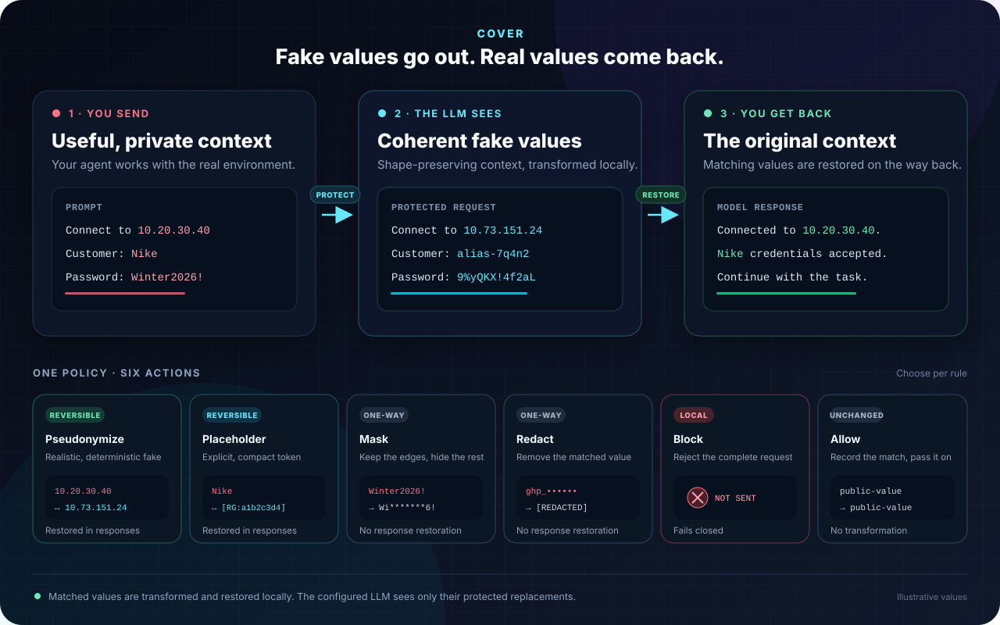

<h1 align="center">Cover</h1>

<p align="center"><strong>Keep private data, internal infrastructure and secrets out of cloud coding agents without breaking your workflow.</strong></p>

<p align="center">
  <a href="https://github.com/DavidCarliez/cover/actions/workflows/ci.yml"></a>
  <a href="go.mod"></a>
  <a href="LICENSE"></a>
</p>

<p align="center">
  <a href="#install">Install</a> ·
  <a href="#quick-start">Quick start</a> ·
  <a href="#privacy-policies">Policies</a> ·
  <a href="#inspect-diagnose-and-monitor">Monitoring</a> ·
  <a href="#pi-and-oh-my-pi">Pi / OMP</a> ·
  <a href="#security-boundary">Security</a>
</p>

Cover is a bidirectional privacy proxy for AI coding agents. It replaces
matched sensitive values locally with realistic, deterministic stand-ins
before a request leaves your machine, then translates matching fakes in normal
and streaming responses back to the originals. The model gets coherent
context; your agent and tools keep working with the real environment.

<p align="center">
  
</p>

Use reversible `pseudonymize` or `placeholder` rules when the conversation must
keep working end to end. Use one-way `mask` or `redact` rules when restoration
is unnecessary, `block` to stop a request locally, and `allow` for an explicit
exception.

Supported clients include **Codex**, **Claude Code**, **Cursor**, **Pi / Oh My
Pi**, and **OpenAI- or Anthropic-compatible SDKs and routers**.

## Install

The installer downloads the release for your OS and CPU, verifies it against
the published SHA-256 checksums, installs it atomically to
`~/.local/bin/cover`, configures selected clients, and starts the proxy.

Configuration and shell-profile updates preserve symlinks and existing file
permissions, including relative links beneath linked directories. If a link's
target does not exist yet, Cover creates the target without replacing the link.

```sh
curl -fsSL https://raw.githubusercontent.com/DavidCarliez/cover/main/scripts/install.sh | bash
```

No Go toolchain or Git checkout is required. You only need `curl`, an archive
extractor (`tar` on Linux/macOS or `unzip` on Windows), and `sha256sum`,
`shasum`, or `openssl` for verification.

Prebuilt Linux, macOS, and Windows archives and their checksums are available
from [GitHub Releases](https://github.com/DavidCarliez/cover/releases).

For a non-interactive install:

```sh
curl -fsSL https://raw.githubusercontent.com/DavidCarliez/cover/main/scripts/install.sh | \
  COVER_AGENTS=openai,claude bash
```

Pin a release or install only the binary with environment variables applied to
the `bash` process:

```sh
curl -fsSL https://raw.githubusercontent.com/DavidCarliez/cover/main/scripts/install.sh | \
  COVER_VERSION=v0.1.0 COVER_SKIP_SETUP=1 bash
```

<details>
<summary><strong>Build manually or cross-compile</strong></summary>

```sh
git clone https://github.com/DavidCarliez/cover.git
cd cover
go build -o cover ./cmd/cover
install -m 0755 cover ~/.local/bin/cover
```

The core binary has no cgo dependency. Standard Go cross-compilation works:

```sh
GOOS=linux GOARCH=arm64 go build -o cover-linux-arm64 ./cmd/cover
GOOS=windows GOARCH=amd64 go build -o cover.exe ./cmd/cover
```

</details>

## Highlights

| Area | Cover functionality |
| --- | --- |
| Policy | Declarative rules with `allow`, `placeholder`, `pseudonymize`, `mask`, `redact`, and `block` actions |
| Realistic replacements | Deterministic generators for IP addresses, hosts, domains, emails, usernames, passwords, UUIDs, URLs, aliases, and numeric identifiers |
| Context-aware rules | JSON keys inside tool-result strings, HTTP headers, cookies, query parameters and form fields, plus regex and built-in detectors |
| Stable identities | Installation-keyed HMAC pseudonyms remain consistent across requests, sessions, and restarts |
| Mapping safety | Bounded, session-isolated, memory-only reversible mappings with TTL and capacity limits |
| Inspection | `cover inspect` previews the protected JSON without contacting an LLM |
| Diagnostics | `cover doctor` verifies policy, daemon health, local fail-closed behavior, and Codex routing |
| Monitoring | Metadata-only audit and monitor views, plus explicit live-only inspection of caught and forwarded content |
| Proxy hardening | Loopback-by-default listeners, body and stream limits, generic safe errors, and fail-closed parsing |
| Streaming compatibility | OpenAI Responses, Chat Completions, and Anthropic SSE restoration across delta events, heartbeats, and interleaved channels; JSON-safe tool arguments |
| Codex compatibility | Responses API and router configuration, compression checks, and immutable `encrypted_content` fields |
| Optional semantic pass | A local llama.cpp detector can inspect free-form text that regular expressions miss |

## Quick start

```sh
cover init             # write ~/.config/cover/config.yaml
cover start --detach   # run in the background
cover doctor           # verify the local setup
cover test             # local redaction round trip, no network call
cover monitor          # watch privacy-safe request metadata
```

`cover init` prompts for OpenAI, Anthropic, or a custom upstream. The complete
configuration is documented in [`configs/config.example.yaml`](configs/config.example.yaml).

### Command reference

| Command | Purpose |
| --- | --- |
| `cover install` | Configure clients, shell exports, and the background proxy |
| `cover init` | Create the configuration file |
| `cover start [--detach]` | Start Cover in the foreground or background |
| `cover stop` | Stop the background process |
| `cover restart` | Restart it in the background |
| `cover status [--json]` | Show process, listener, and redacted upstream status |
| `cover version [--json]` | Show build version, commit, and date |
| `cover update [--version vX.Y.Z]` | Install a verified GitHub release; restart and check health if running (Linux/macOS) |
| `cover update --rollback` | Restore the previous binary, preserving configuration |
| `cover env` | Print shell exports for configured clients |
| `cover test` | Run a synthetic local redaction and restoration check |
| `cover inspect request.json` | Preview exactly what Cover would forward |
| `cover doctor [--json]` | Run configuration, privacy, daemon, and routing checks |
| `cover monitor` | Show recent safe metadata and follow new events |
| `cover monitor --show-content` | Show one sensitive original → replacement pair per line; add `--json` for full events |
| `cover models pull` | Download the optional local detector runtime and model |
| `cover models status` | Report local detector installation and configuration |
| `cover completion` | Generate shell completion scripts |

Stopping Cover does not change client configuration. A client still pointed at
Cover will fail to connect until Cover is restarted or the client is pointed
back to its direct provider or router.

`stop`, `restart` and `update` only signal a process that is Cover: the
listener must report that process on the loopback-only `/__cover/health`
endpoint, or the process executable must be named `cover`. A stale pidfile,
including one whose process ID now belongs to another program, is removed,
and another program on Cover's port is never stopped.

Stops and restarts drain active requests for up to 30 seconds, configurable
with `shutdown_timeout_ms`. On Windows, which has no SIGTERM, `cover stop`
ends the process without draining. After that deadline, remaining connections close.
New connections can fail briefly during restart; this is not a zero-downtime
handover. `cover status` and `cover doctor` report when the running daemon
differs from the installed binary.

On Linux/macOS, `cover update` downloads a published release over HTTPS,
verifies its SHA-256 against the release checksums, validates the candidate,
and saves the current binary for rollback. If the restarted daemon fails its
health check, Cover restores the previous binary and attempts to restart it.
Configuration is preserved. Windows users should stop Cover and rerun the
release installer. Updates use published releases, not unreleased commits on
`main`; checksums detect damaged downloads but are not independent signatures.

## Privacy policies

Built-in regex detection covers AWS and GCP keys, GitHub, GitLab, Slack,
Stripe, and Anthropic tokens, private-key blocks, JWTs, explicit generic secret
assignments, emails, SSNs, credit cards, phone numbers, and IBANs. A bare OpenAI
`sk-...` value is deliberately not a dedicated built-in category. Define an
explicit rule if your environment needs one. Built-in detectors match within a single line:
a phone number, SSN, card number or `secret = value` assignment split across
lines is not detected.

Rules live under `rules` in `~/.config/cover/config.yaml`. Each rule uses one
selector: `pattern`, `detector`, `keys`, `headers`, `cookies`, `query_params`,
or `form_fields`. Do not combine selector kinds in one rule.

```yaml
rules:
  password_fields:
    keys: [password, passwd, pwd, passphrase, user_password, database_password]
    category: password
    action: pseudonymize
    generator: password
    priority: 220

  ipv4_addresses:
    detector: builtin_ipv4
    category: ip_address
    action: pseudonymize
    generator: ipv4
    priority: 100

  customer_name:
    pattern: '(?i)\bNIKE\b'
    category: customer
    action: pseudonymize
    generator: alias
    priority: 80

  forbidden_secret:
    pattern: '(?i)secret\s*[:=]\s*(?P<value>[^\s,;]+)'
    action: block
    priority: 200
```

Key selectors protect complete values, including short strings. For example,
`{"password":"admin"}` is protected without treating every
`{"username":...}` as a password. A selected array or object applies the
policy to its scalar descendants; a higher-priority child rule can override it.
Named `(?P<value>...)` groups let a regex replace only the captured value.

### Protected values stay protected

Once any rule protects a value, Cover protects that same value wherever it
appears again, with the same action and the same deterministic replacement:

- in prose, commands or other fields of the same request, wherever they appear;
- on later turns, after a response restored it and the agent sent it back in
  its history, including from a new session or a compacted summary;
- in JSON-escaped, HTML-escaped and URL-encoded forms of the value;
- as an unselected JSON number of six or more digits equal to a protected
  numeric value.

Values shorter than 4 bytes are not matched outside their selected field.
Values shorter than 8 bytes, and numbers, only match as whole words, so a
protected `admin` does not change `administrator`. In the example above, a
`{"username":"admin"}` next to `{"password":"admin"}` is therefore protected
too, because sending it would disclose the password. Fields covered by an
explicit `allow` key rule stay unchanged.

This memory is held only in process memory, bounded by
`mappings.max_known_values` (default 50,000) and
`mappings.known_value_ttl_minutes` (default 24 hours). Protective occurrences
renew each original's lifetime, including when overlapping originals share one
output placeholder. After a restart, a value is protected again once a rule
matches it.

| Action | What the LLM receives | Response behavior |
| --- | --- | --- |
| `allow` | The original value | Unchanged |
| `placeholder` | A short opaque token | Restored locally when repeated |
| `pseudonymize` | A realistic, deterministic fake | Restored locally when repeated |
| `mask` | The first and last characters with the middle masked | One-way; not restored |
| `redact` | `[REDACTED]` | One-way; not restored |
| `block` | Nothing; Cover rejects the complete request locally | No upstream response |

When matches overlap, no byte selected by a protective rule is sent. A
`block` match blocks the request. Otherwise the highest-priority match that
covers the whole overlapping span is applied; if none does, the span becomes
one placeholder. An `allow` match only exempts protective matches that it
fully contains and that do not outrank it, so allowing `corp.example.com`
does not expose `alice@corp.example.com`.
Known-value matching retains the original spans and priorities until this
resolution step; rebuilding its matcher does not change policy precedence.
An overlap union uses a placeholder rather than applying a numeric or other
typed generator to a synthetic combined value.

Pseudonym generators: `ipv4`, `ipv6`, `hostname`, `domain`, `fqdn`, `email`,
`username`, `password`, `secret`, `uuid`, `url`, `alias`, and `number`.
The `url` generator replaces the host, credentials, every path segment, query
values and the fragment; only the scheme, port, segment count and query keys
remain. Host, domain and email fakes use `example.com`, or a private suffix
such as `.internal` when the original has one, never a real public domain.
`mask` shows at most a sixth of a value at each edge (none below six
characters).

Rules are validated at startup. Invalid selectors, expressions, actions,
generators, or capture groups prevent Cover from starting. Detector errors,
mapping exhaustion, malformed JSON, compressed bodies, and explicit blocks do
not fall back to forwarding the original request.

### Structured tool results and HTTP values

Key rules also inspect serialized JSON in OpenAI tool messages and Responses
function outputs, Anthropic tool results, and MCP text/structured content.
Supported presentations include nested JSON strings, JSON fences, explicit
CLI result prefixes, raw HTTP transcripts, and text-rendered HTTP request/response
objects. Business JSON does not bypass a rule merely because a field is named
`id`, `type`, `role`, `name`, or `encrypted_content`. Actual provider routing and
opaque protocol fields remain unchanged.

Tool-definition and structured-output JSON Schemas are protocol metadata:
property names, types, constraints, enums and examples remain unchanged.
Do not place private values in these schema slots. This exception is scoped to
actual protocol definitions, not ordinary business fields named `schema`,
`tools`, `parameters` or `type`. Tool argument values are still inspected.

```yaml
rules:
  auth_headers:
    headers: [Authorization, X-Api-Key]
    action: pseudonymize
    generator: secret
  session_cookies:
    cookies: [session, sessionid]
    action: pseudonymize
    generator: alias
  query_tokens:
    query_params: [access_token, api_key]
    action: pseudonymize
    generator: secret
  form_credentials:
    form_fields: [password, client_secret]
    action: pseudonymize
    generator: password
  numeric_identifiers:
    keys: [customer_number]
    action: pseudonymize
    generator: number
```

Headers match case-insensitively. Other named selectors are case-insensitive
unless `case_sensitive: true` is set. Header rules select the whole header
value; cookie rules select individual values in `Cookie` and `Set-Cookie`.
Query/form values are decoded once, transformed, and re-encoded once.
Unchanged parameters retain their original bytes, including duplicates.
HTTP `Content-Length` is recalculated when a body changes.
Assignment detectors also inspect the original decoded `name=value` context;
parsing a query or form does not remove the context required by a password
assignment rule. Generated aliases are not scanned again within that pass.
An explicit whole-header policy for `Cookie` or `Set-Cookie` owns that header,
including an explicit `allow`; otherwise each original cookie value is
inspected once.

Header-only captures are supported: a request/status line and complete header
lines can end without a blank separator or body. Their `Content-Length` and
encoding headers describe the omitted body and are preserved. A blank separator
marks a full message instead; body-length and encoding checks still apply.

These selectors apply to HTTP text inside model-request JSON, such as captured
tool output. They do not filter the model API connection's own headers, URL
path, or query string, which Cover preserves for routing and authentication.

Literal curl arguments are inspected too, including `--header` (also in
combined flags such as `-sSH`), `--cookie`, URLs, JSON/form `--data` variants,
`--data-urlencode`, `-F` form fields, `-G` query data, and `-u`/`--oauth2-bearer`
credentials, which an `Authorization` header rule owns. This also protects
restored commands when an agent sends its execution history on the next turn.
Changed arguments are shell-quoted; Cover does not execute shell expressions
or read `@file` contents. A command with shell composition such as pipes or
`;`, or one whose changed argument contains shell expansion, is not
rewritten as a command: it is scanned as plain text, and values are replaced
in place. An `Authorization` rule still protects `-u`, `--user`, `-U`,
`--proxy-user` and `--oauth2-bearer` values there, including attached values in
combined short options. Arguments belonging to other options are not treated
as credential options, and `--` ends option parsing. In mixed literal/variable
credential words, only literal portions are replaced; shell expansions, quotes
and authentication separators stay unchanged.

Detectors also inspect query parameter names, value-less parameters and
cookie names.

Use `number` for opaque numeric identifiers, not values the model must use in
calculations. It emits a deterministic signed integer below JavaScript's exact
integer limit. JSON numbers stay numbers; restoration retains the original
integer, fraction or exponent representation. Numeric aliases also restore in
recognized HTTP/curl values, URL path segments and prose.
Selected numbers require `allow`, `block`, or `pseudonymize` with `number`.
Selected booleans require `allow` or `block`; null stays null.

Malformed recognizable JSON, NDJSON and JSON-like source with a selected key
are not rejected when every selected value is a scalar: those values are
protected as plain-text assignments. Malformed JSON that gives a selected key
an object, an array or an unterminated string, puts its value on another
line, or spells the key with escapes is rejected, not forwarded. Candidate
names use JSON decoding, including escaped slashes and Unicode surrogate pairs.
Malformed HTTP framing, unsupported encoded/chunked wire bodies, and exhausted
parser budgets also fail closed. A standalone URL or form with a literal `%`,
such as `?progress=50%`, is scanned as plain text, unless a selected
parameter name in it is percent-encoded, which is rejected. HTML `data-` attributes
use the `keys` rule for the rest of their name, so `data-password` is
selected by `password`.

Parsing budgets are 64 structural levels, 100,000 nodes, eight embedded parsing
levels and 4 MiB of decoded JSON/HTML per request. Each HTML document also has
a 4 MiB field-identity budget. HTTP transcripts are limited to 8 MiB, 64 KiB per
line, 256 headers/cookies, 4,096 parameters and 32 messages. These limits are
in addition to the configurable HTTP body limits.

Streamed tool arguments are buffered per tool until their JSON is complete,
then restored with the correct nested JSON, URL and shell escaping. Restored
arguments are split at UTF-8 boundaries. Redundant argument-only events are
removed when restoration shortens the document, rather than emitting long runs
of empty deltas. Tool identity, mixed content and lifecycle events are retained.
`limits.sse_event_bytes` bounds each event, and `limits.response_bytes` bounds
the events held back while arguments are buffered, so large tool calls such as
a file write stream normally. Arguments cut short, for example by
`max_tokens`, are passed on with whole replacements restored, so the client
sees the provider's stop reason. Ordinary text deltas, heartbeat comments and
Anthropic `ping` events continue to stream; while events are held back, Cover
also sends an SSE comment every 10 seconds so clients do not time out.

### Selected names in plain text

Named selectors also protect assignments written as plain text, where no
parser recognizes the structure: a JSON fragment inside prose or a code
block, YAML, `.env` files, CLI flags, Python dicts, logs, or a URL inside a
sentence. A `keys`, `form_fields`, `query_params` or `cookies` rule matches
`name: value`, `name=value`, `"name": "value"` and `'name': 'value'`; a
`headers` rule matches `Name: value` up to the end of the line or quote.
Names match whole words with the rule's case sensitivity. Values are
protected exactly as written. Unquoted `true`, `false`, `null`, shell
variables such as `$PASSWORD` and function calls such as `os.getenv(...)` are
left unchanged. A value that its generator cannot represent, such as a
non-numeric value for `number`, becomes a placeholder.

### Deterministic HTML inspection

Recognized HTML documents, fragments, HTML fences, HTTP HTML bodies and literal
curl HTML bodies use the same configured policies. No local model, browser
execution or additional feature flag is required.

- `keys` and `form_fields` select input/button values, textarea contents,
  select option values/text, and `meta`/`param` content or value attributes.
  Candidate names come from `name`, `id`, `property`, `itemprop`, associated
  labels and ARIA labels. Password controls also have the candidate name
  `password`, even when their actual name differs. Labels must match a
  configured selector; Cover does not infer that an arbitrary label denotes
  private data.
- Named attribute values use `keys` rules. Other attributes and text use the
  configured detectors. Entity references are decoded before inspection.
  Text is joined across inline elements within a block, with normalized
  whitespace, so markup cannot simply split a configured text signature.
- URL attributes apply query-parameter policies, including relative URLs.
  `srcdoc` is inspected recursively. Typed JSON scripts use structured JSON
  policies; ordinary scripts, styles and comments receive literal text scanning.
- Existing rule priority and explicit `allow` decisions still apply. Numeric
  fields can use `number` to share aliases with equivalent JSON numeric values.

Unchanged HTML keeps its original bytes. Changed HTML is serialized safely:
quotes, entity spelling, tag casing and implied structure can normalize.
Restoration preserves decoded values, not byte-for-byte markup formatting.
Special characters remain data rather than becoming active HTML or closing
a JSON script. HTTP content lengths and curl quoting are updated as needed.

Field tags that the parser does not own, such as an `<input>` inside
`<noscript>` or a comment, in HTML preceded by other text, or in a custom
element, are still matched by name in plain text. Multipart `form-data` parts
whose `name` is selected by a `keys` or `form_fields` rule are protected the
same way.

Incomplete tags, duplicate attributes, unsafe parser recovery, unsupported
constructs and exhausted budgets fail closed. The parser does not execute or
deobfuscate JavaScript, inspect CSS semantics, decode arbitrary attachments,
perform OCR, or interpret every browser accessibility-dump format. Unknown
names, addresses and confidential prose still require rules or a local
data-release policy; successful HTML parsing is not a privacy classification.

### Stable pseudonyms and reversible mappings

Short replacements, numbers and IP addresses are restored only where they
stand as a whole token: an alias such as `host-k3x9q2` is restored in
`host-k3x9q2.` or `(host-k3x9q2)`, but not inside `host-k3x9q20` or
`myhost-k3x9q2`. Longer replacements, such as passwords, emails and
placeholders, are restored wherever they appear. Where a protected value is
part of a longer word, as in `dbprimary01_backup.sql`, a short replacement
could not be restored there, so that occurrence gets a placeholder instead.
Streams hold back a possible replacement until the following character is
known.

Cover creates `~/.config/cover/pseudonym.key` with owner-only permissions.
HMAC-SHA-256 derives the same pseudonym for the same original value across
sessions and restarts. Different installations produce different pseudonyms.

The key cannot recover original values. Restoration uses bounded mappings held
only in process memory. Mappings are separated by `X-Cover-Session`, expire
after the configured TTL, and are deleted when an isolated request completes.
Restoring a response keeps its session alive. When `mappings.max_sessions` is
reached, the least recently used session is evicted instead of refusing new
conversations.
Back up the key only if stable pseudonym continuity matters.

## Inspect, diagnose, and monitor

### Preview without sending

```sh
cover inspect request.json
cover inspect request.json --session demo
```

The report contains the transformed request, matched rules, categories,
actions, warnings, and blocked state. It does not send a network request or
print the reversible mapping.

### Check the installation

```sh
cover doctor
cover doctor --json
```

Doctor validates the configuration, listener policy, limits, pseudonym key,
redaction round trip, upstream-loop protection, daemon, fail-closed behavior,
audit log, environment routing, Codex provider, and Codex request compression.
Its live probe is rejected locally and does not spend model tokens.

### Safe monitoring by default

```sh
cover monitor
cover monitor --follow=false -n 50
cover monitor --json
```

The default monitor shows only allowlisted metadata: time, HTTP status,
transformation count, byte counts, latency, categories, and generic errors.
Known failures include a plain-language explanation and next step, such as
which size limit to adjust or whether the provider timed out. JSON output
includes `error`, `explanation`, and `next_step` for these failures.
Audit logs never contain request or response bodies, matched values, mappings,
paths, queries, or upstream credentials.

### Explicit sensitive live view

```sh
cover monitor --show-content
cover monitor --show-content --once
cover monitor --show-content --json
```

This opt-in view prints only `"original" -> "replacement"`, one pair per line.
Control characters are escaped so values cannot span multiple terminal lines.
Add `--json` to include the full event and exact transformed outbound JSON.
The view is live-only and never added to the audit log. Capture starts after an authenticated local
viewer connects and stops when it disconnects. The stream is loopback-only,
uses a token derived from the installation key, and disconnects a viewer that
falls 16 events behind or stops reading for 10 seconds. Stopping Cover ends
live views immediately instead of waiting for them.

> [!WARNING]
> This terminal output is sensitive. Do not use `--show-content` in shared
> terminals, recorded sessions, CI logs, or support transcripts.

## Connect clients

Cover forwards request methods, paths, queries, and headers to the configured
upstream. Existing provider authentication still works because Cover does not
rewrite authentication headers.

### Codex and Codex Router

Codex uses the Responses API. Add a user-level provider to
`~/.codex/config.toml` and disable request compression so Cover can inspect the
body:

```toml
model_provider = "cover"

[model_providers.cover]
name = "Cover"
base_url = "http://127.0.0.1:8317"
wire_api = "responses"
requires_openai_auth = true
supports_websockets = false

[features]
enable_request_compression = false
```

These keys follow the official
[Codex configuration reference](https://developers.openai.com/codex/config-reference/).
If `[features]` already exists, add the setting to that table. For a router
that reads a token from the environment, replace `requires_openai_auth` with
`env_key = "YOUR_ROUTER_KEY_ENV_NAME"`.

Keep Cover's `upstream` pointed at the real router URL. Use
[`configs/codex-router.example.yaml`](configs/codex-router.example.yaml) as a
starting point. The selected model can be OpenAI, Anthropic, Gemini, DeepSeek,
or another model because Cover operates on the router's generic JSON traffic.

If a router omits the response `Content-Type`, Cover recognizes SSE streams
that start with `event:`, `data:`, or a comment (`:`). It restores replacements
split across delta events and sends `Content-Type: text/event-stream` to the
client. Explicit response media types remain authoritative.

Responses API [`encrypted_content`](https://developers.openai.com/api/docs/guides/reasoning#encrypted-reasoning-items)
fields are opaque and cryptographically verified. Cover leaves them unchanged
during request scanning and response restoration.

### Claude Code, SDKs, and other clients

```sh
export ANTHROPIC_BASE_URL=http://127.0.0.1:8317
export OPENAI_BASE_URL=http://127.0.0.1:8317/v1
```

Claude Code uses the first form. OpenAI-compatible SDKs and clients generally
use the `/v1` form. The installer can persist these settings, and `cover env`
prints the exports for the clients selected during installation.

SDK constructors can set the same base URL directly:

```python
client = OpenAI(base_url="http://127.0.0.1:8317/v1", api_key=os.environ["OPENAI_API_KEY"])
client = anthropic.Anthropic(base_url="http://127.0.0.1:8317", api_key=os.environ["ANTHROPIC_API_KEY"])
```

Cursor and other applications can use the same endpoint when they expose an
API base URL setting. Confirm routing with `cover doctor` or `cover monitor`.

### Pi and Oh My Pi

The official `cover-plugin` controls Cover from Pi or Oh My Pi while keeping
the privacy engine in the local Go proxy:

```sh
pi install npm:cover-plugin
```

Configure only the providers that must go through the current Cover upstream:

```text
/cover providers openai-codex,deepseek=/
/cover on
/cover doctor
```

OpenAI-family providers default to the `/v1` proxy path. `=/` selects the proxy
root for transports such as DeepSeek that add their own request path. Use
`/cover status`, `/cover start`, `/cover stop`, and `/cover monitor` for normal
operation. `/cover off` restores direct provider routing.

Protection is fail-closed by default: while enabled, configured providers remain pointed
at Cover when its daemon is unavailable, so requests fail locally rather than
bypassing the proxy. Extension state is private and local at
`~/.config/cover/harness.json`.

Opt in with `/cover fallback on` to send new user turns directly if Cover is
unavailable. The compact indicator is **&#x1F512;** only when the active
provider has a Cover route, including a fail-closed route. It is **&#x1F513;**
when Cover is off, direct fallback is active, the active provider is unconfigured,
or coverage is unknown. `/cover status` explains the active provider's coverage.
Protection resumes when Cover is available at the next user turn.
`/cover fallback off` restores fail-closed behavior for configured providers.
Failed requests and tool continuations are not replayed directly.
The original provider configuration must support direct connections.

OMP users can add this repository as a marketplace:

```sh
omp plugin marketplace add DavidCarliez/cover
omp plugin install cover-plugin@cover
```

## Optional local LLM detector

Regex and key-aware rules cannot identify every name, address, customer ID, or
internal codename. Cover can run a small local
[`llama.cpp`](https://github.com/ggml-org/llama.cpp) model as an additional
semantic detector.

```sh
cover models pull
cover models status
cover restart
```

The default model is `Qwen2.5-0.5B-Instruct` in a roughly 490 MB Q4 GGUF. Cover
starts `llama-server` on loopback and enforces per-call and overall request
budgets. Missing binaries, startup failures, timeouts, and detector errors fail
closed when the detector is enabled. Returned spans must occur verbatim in the
input before Cover accepts them.

This is supplemental detection, not a release approval. By default, strings
outside 8–2,000 bytes skip semantic inspection; long pages are not automatically
chunked. The current semantic prompt also exempts self-labeled example data.
Neither behavior disables deterministic field/regex policies, but enabling the
local model alone does not make arbitrary website content safe to send.

Leave this feature disabled on unsupported platforms. See the
`detectors.llm_fallback` section in
[`configs/config.example.yaml`](configs/config.example.yaml) for limits,
batching, concurrency, and model paths.

## Security boundary

Cover protects values selected by enabled rules and detectors in JSON bodies
that actually pass through the proxy. Selected numeric fields are supported;
unknown content is not blocked merely because no rule recognizes it.
Fail-closed parsing and detector errors do not prevent detection false negatives.

Data can still leave the machine when it appears in:

- a value that no enabled detector or rule recognizes;
- a field covered by an `allow` rule;
- the model API connection's own HTTP headers, URL paths, or query strings;
- image pixels, encoded attachments, opaque file references, or unsupported
  encodings inside otherwise valid JSON;
- unselected numeric or boolean values, or JSON property names;
- structural protocol fields such as model, role, type, IDs, and tool or
  function names;
- opaque `encrypted_content`, which must remain unchanged for protocol safety;
- traffic from a client that bypasses Cover.

Inline image handling is configurable with `media.images: allow`, `warn`, or
`block`. Under `allow` and `warn`, encoded image data, image URLs, and image
file IDs pass through unchanged because scanning encoded image data as text
can corrupt it. Cover does not inspect pixels, and no media policy can
recognize every possible encoding.

Cover rejects non-loopback listeners unless `network.allow_remote: true` is
explicitly configured. The upstream must be an `http` or `https` URL that does
not point back to Cover's own listener. Each Cover process also adds a random
`X-Cover-Hop` identifier to forwarded requests and answers HTTP 508 when a
request returns carrying its own identifier. Hop-by-hop headers, including
`Proxy-Authorization` and headers named by `Connection`, are not forwarded.
Upstream connections honour `HTTPS_PROXY`/`NO_PROXY` and use HTTP/2 when
the upstream offers it. If Cover and its upstream router run on different
hosts, use TLS or another trusted transport and apply separate network access
controls. Cover itself does not authenticate ordinary proxy traffic.

Request, buffered-response, total-stream, and per-SSE-event limits bound memory
use. Oversized requests return HTTP 413, oversized buffered responses return
HTTP 502, and oversized or interrupted streams fail at the transport level so
clients can detect incomplete output. Defaults are 64 MiB per request, 32 MiB
per response, and 4 MiB per SSE event or queued restoration data.

`upstream_timeouts.response_idle_timeout_ms` limits how long Cover waits for
the next response bytes (default: 300000, or five minutes). Active responses
can continue longer. A stalled buffered response returns HTTP 502; a stalled
stream is aborted. Client cancellation also cancels the upstream request.

### Website-crawling agents

Cover is a model-traffic filter, not a browser, shell, or MCP network gateway.
Tool results are inspected when a client sends them through Cover to a model.
Remote tools and provider-side browsing can receive or retrieve private data
before that boundary. Restored credentials can also be used in subsequent tool
requests; Cover does not enforce destination restrictions on those requests.

For privacy-sensitive crawling:

- Keep automatic direct fallback off and explicitly route every model provider
  through Cover. The status indicator is not proof that the active provider or
  another process uses a covered route; enforce direct-egress restrictions
  separately when bypass must be impossible.
- Set `media.images: block` if screenshots and image references must not leave.
  Gate other attachments separately: this setting is not a general file filter.
- Use HTML inspection for supported page markup and configured field/text
  policies. Extract other page/document formats locally into a known schema;
  Cover does not decode every representation or infer every private field.
- Define site-specific rules for private fields and identifiers. Generic
  signatures do not establish that names, addresses, records, financial values,
  or confidential prose have been removed.
- Use local tools and separate destination/credential controls. Disable remote
  or provider-side tools that would disclose private data outside this boundary.
- If private data must never reach an external model, keep unknown content local
  and release only explicitly approved fields. A fully local model is the safer
  option when the task requires the original private content.

`cover inspect` can reveal gaps without forwarding the request. Its output can
still contain undetected private data; do not publish it or include it in agent
context without review. Zero matches is not a statement that content is public.

Read [`SECURITY.md`](SECURITY.md) before reporting a vulnerability. Please use
the private reporting route described there rather than opening a public issue.

## Project

- Development and tests: [`CONTRIBUTING.md`](CONTRIBUTING.md)
- Conduct: [`CODE_OF_CONDUCT.md`](CODE_OF_CONDUCT.md)
- License: [Apache License 2.0](LICENSE)
